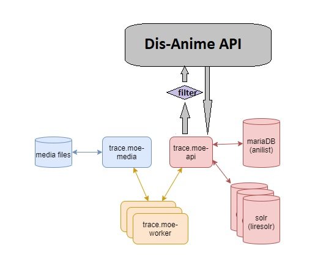

# Dis-Anime -cs50-final-project

##### What is the `Dis-Anime`

Discover Anime it's a web Application help anime fans to find anime name and details of anime using photo only! 

#### ScreenShoot: 

##### How `Dis-Anime` work?
`Dis-Anime` use [trace.moe.api](https://soruly.github.io/trace.moe-api/#/docs) to searching in frames of image and compare it with anime videos 

look at blow image to consider :

The benefit of `Dis-Anime` we add a filter to filter the results and remove the NSFW content make this useful for all untill children's  

##### Technical Used:
- Python (Flask)
- HTML 
- CSS
- JS
- Requests (Python Library)
- Tailwind CSS

##### How To Run:
Just Clone this repositry to you local machine / Server 
And go to the root folder and run this command
`python -m flask run`

something need to check if it's installed on your machine 
- Python
- Flask

